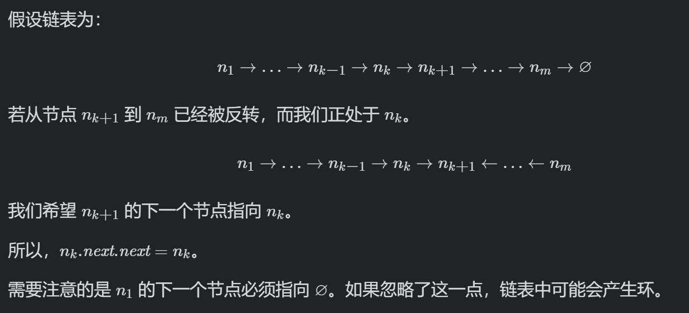

# 剑指 Offer 24. 反转链表
练习链接：https://leetcode-cn.com/problems/fan-zhuan-lian-biao-lcof/

## 题目描述
定义一个函数，输入一个链表的头节点，反转该链表并输出反转后链表的头节点。  

* 示例:  
输入: 1->2->3->4->5->NULL  
输出: 5->4->3->2->1->NULL  

限制：  
0 <= 节点个数 <= 5000  

## 方法一：迭代
在遍历链表时，将当前节点的 next 指针改为指向前一个节点。由于节点没有引用其前一个节点，因此必须事先存储其前一个节点。在更改引用之前，还需要存储后一个节点。最后返回新的头引用。

```javascript
var reverseList = function(head) {
    let prev = null
    let curr = head
    while(curr){
        const next = curr.next
        curr.next = prev
        prev = curr
        curr = next
    }
    return prev
};
```
复杂度分析  
时间复杂度：O(n)，其中 n 是链表的长度。需要遍历链表一次。  
空间复杂度：O(1)。  

## 方法二：递归
递归版本稍微复杂一些，其关键在于反向工作。假设链表的其余部分已经被反转，现在应该如何反转它前面的部分？

```javascript
var reverseList = function(head) {
    if (head == null || head.next == null) {
        return head;
    }
    const newHead = reverseList(head.next);
    head.next.next = head;
    head.next = null;
    return newHead;
};
```
复杂度分析  
时间复杂度：O(n)，其中 n 是链表的长度。需要对链表的每个节点进行反转操作。  
空间复杂度：O(n)，其中 n 是链表的长度。空间复杂度主要取决于递归调用的栈空间，最多为 n 层。  

作者：LeetCode-Solution  
链接：https://leetcode-cn.com/problems/fan-zhuan-lian-biao-lcof/solution/fan-zhuan-lian-biao-by-leetcode-solution-jvs5/